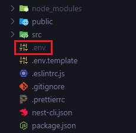
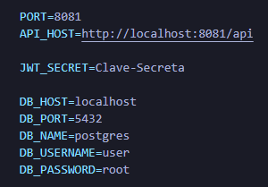

<h1 align="center">Environment Variables</h1>

<p align="right">
  <a href="http://nestjs.com/" target="blank"></a>
</p>

<p align="center">
  
</p>

### 1. Install dependencies

```bash
npm i nestjs/config
```

### 2. Update file `src/app.module.ts`

- import dependency

```nestjs
import { ConfigModule } from '@nestjs/config';
```

- import module

```nestjs
@Module({
  imports: [
    ConfigModule.forRoot()
  ],
})
```

### 3. Create file `.env`

```bash
PORT=<puerto-app>
```

### 4. Update file `main.ts`

- add console.log()

```nestjs
  console.log(
    `Server running on http://localhost:${process.env.PORT ?? 3000}/api`,
  );
```

### 5. Create file `.env.template`

- declare empty variable

```bash
PORT=
```

<details closed>
  <summary><b>capture</b></summary>

<br>
<p>
  
</p>

</details>
