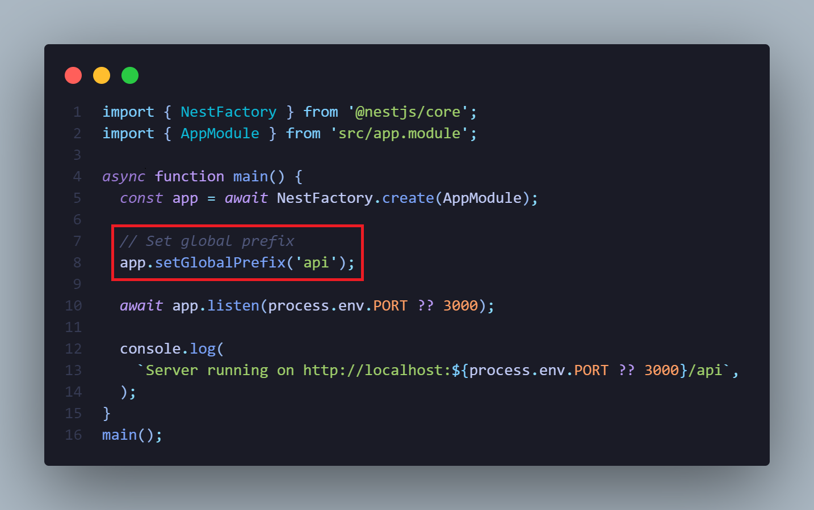

<h1 align="center">Global Prefix</h1>

<p align="right">
  <a href="http://nestjs.com/" target="blank"></a>
</p>

<p align="center">
  
</p>

- ### Update file `src/main.ts`

1. Set global prefix

```nestjs
app.setGlobalPrefix('api');
```

<details closed>
  <summary><b>capture</b></summary>

<br>
<p>
  
</p>

</details>

- ##### [official documentation](https://docs.nestjs.com/openapi/other-features)
