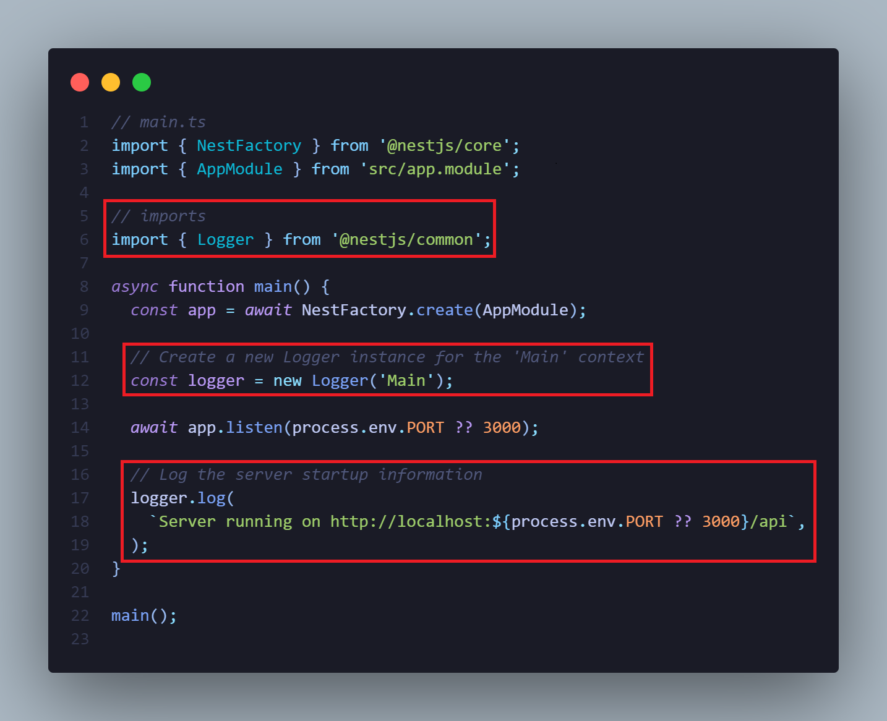

<h1 align="center">Logger Server Startup</h1>

<p align="right">
  <a href="http://nestjs.com/" target="blank"></a>
</p>

<p align="center">
  
</p>

- ### Update file `src/main.ts`

1. Add imports

```nestjs
import { Logger } from '@nestjs/common';
```

2. Create a new Logger instance

```nestjs
const logger = new Logger('Main');
```

3. Add log in the server

```nestjs
  logger.log(`Server running on http://localhost:${process.env.PORT ?? 3000}/api`);
```

<details closed>
  <summary><b>capture</b></summary>

<br>
<p>
  
</p>

</details>

- ##### [official documentation](https://docs.nestjs.com/techniques/logger)
